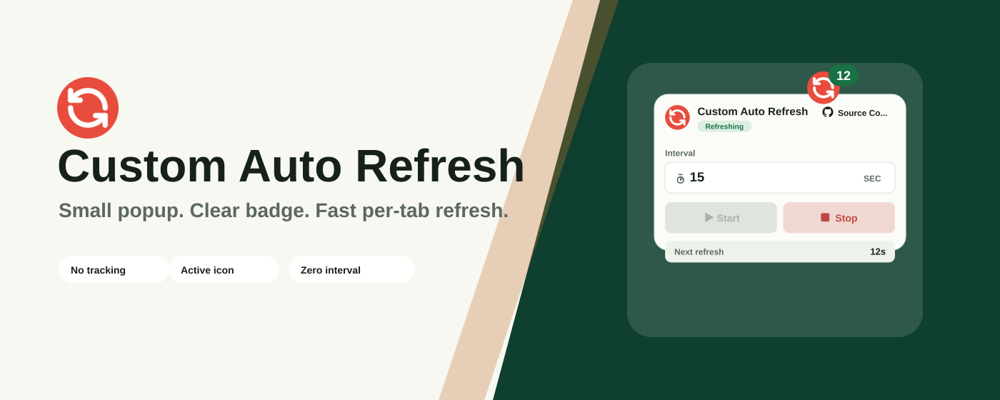

# Custom Auto Refresh

Local-first, lightweight browser extension for refreshing the current tab on your schedule.

Custom Auto Refresh is configurable and written in Svelte. It does not track users, collect analytics, or send browsing data to a remote service.

Refresh schedules and custom settings are stored locally by the browser, so active timers can recover when the extension context restarts.



## Install

[](https://chrome.google.com/webstore/detail/lpfhikbcgmboakfdiedcccfofbejaihd)
[](https://addons.mozilla.org/en-US/firefox/addon/custom-auto-refresh/)
[](https://microsoftedge.microsoft.com/addons/detail/ppgdhapocgbafpplfbknkjbmflphefed)

## Features

- Start or stop automatic refreshes for the active tab.
- Set intervals in milliseconds, seconds, minutes, or hours.
- Use intervals up to seven days.
- Customize refresh jobs with hard reload, immediate refresh, maximum refreshes, and time limits.
- Watch the next refresh countdown in the extension badge.
- Lightweight popup UI written in Svelte and TypeScript.
- Build separate packages for Chrome, Edge, and Firefox from one source tree.
- Localized browser UI strings through extension `_locales`.

## Development

The extension UI is written in Svelte 5 and built with Vite.

Shared TypeScript modules handle interval parsing, refresh options, browser messaging, and the background service worker.

```sh
npm install
npm run dev
```

Useful commands:

```sh
npm run check
npm run test
npm run build
npm run package
```

`npm run build` generates icons, builds the Svelte app, and writes browser-specific extension directories to:

- `dist/chrome`
- `dist/edge`
- `dist/firefox`

Load one of those directories as an unpacked extension during manual testing.

## Store Assets

Assets are grouped by lifecycle:

- `assets/brand/` source artwork.
- `assets/extension/` static files copied into the extension package.
- `assets/store/` generated store icons, screenshots, and promotional tiles.

Regenerate store assets with:

```sh
npm run icons
npm run store:screenshots
```

## Releases

Pushing a tag like `v2.4.1` runs the release workflow. The workflow applies the tag version, checks the project, builds all browser targets, packages zip artifacts, and uploads them to the GitHub release.

## License

MIT
